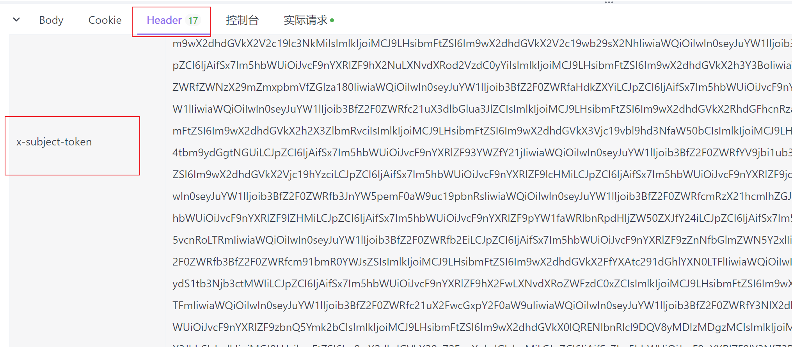

## 在线训练和模型权重拉取

目录：Documents/ota

```python
pip install -r requirements.txt
```

(已安装)

```python
python main.py
```

其中，需要训练的视频文件需要存放在ota/videos下；返回的权重默认保存在ota/目录下。

如果需要修改，可自行在代码中修改对应的目录即可。

PS：采用的AK/SK认证方式，所有的标注以及训练代码已经上传在贾雨凡个人OBS中，如需修改为自己的，请在代码中修改为自己的AK/SK，以及相关的所有的桶目录的路径（不建议修改）


## 云侧API调用

云测 API 需要使用token进行使用，所以部署在 zgb 的华为云平台，api 代码和部署文件在mtcnn文件夹下。

### api代码和部署

在 `customize_service.py` 代码中包含 mtcnn 的推理代码，有视频推理和图片推理两种，当前部署的api服务是使用视频推理，视频推理返回的结果是每一帧相对 `**视频第一帧**` 的三个方向的角度。

如果要换成图片推理，将下面的 `infer_video` 换成 `infer_image` 即可。

```python
class MTCNN_model:
    def __init__(self):
        self.device = torch.device("cuda")
        load_models('/home/ma-user/infer/model/1/infer_models',self.device)
    
    def inference(self, source):
        res = infer_video(source,self.device)
		# res = infer_image(source,self.device)
        return res
```

如若换成cpu部署，需要修改代码。

### API调用

获取token后，执行：

```python
python mtcnn_api.py
```

### 代码讲解

mtcnn_api.py 文件的代码中（下方代码）中主要有四个变量需要知道即可：

```python
import requests

if __name__ == '__main__':
    # Config url, token and file path.
    url = "https://2805eb0000f8458c8c3b0e67d1eda869.apig.cn-north-4.huaweicloudapis.com/v1/infers/00a0f8c9-8514-41ae-b710-6e3738cf2e87"
    token = "省略"
    file_path = "../yolo/1.mp4"

    # Send request.
    headers = {
        'X-Auth-Token': token
    }
    files = {
        'images': open(file_path, 'rb')
    }
    resp = requests.post(url, headers=headers, files=files)

    # Print result.
    print(resp.status_code)
    print(resp.text)
```


`url` ： 是在线应用的url，启动在线应用后直接复制即可。如果不修改在线应用，则不需要改动url。


`token`： token是用户的访问token，只有24h使用期限，需要每次修改这个值。快速获得token的教程：

 1. 打开在线的postman网站，可以在线使用，不需要下载软件：https://app.apifox.com/user/login?redirect=https://app.apifox.com/main

 2. 然后新建项目，复制json, 参数Params填写：Content-Type 和 application/json

    
    
    body 填写以下json：
    
    

```json
{
  "auth": {
    "identity": {
      "methods": ["password"],
      "password": {
        "user": {
          "name": "zgb", 
          "password": "******",
          "domain": {
            "name": "nobody_zgb"  
          }
        }
      }
    },
    "scope": {
      "project": {
        "name": "cn-north-4"  
      }
    }
  }
}
```


3. 然后点击发送就可以在底部的Headers中拿到token




`file_path`: 就是上次的视频/图片路径

`resp.text`：就是返回的result，从中读取偏转角即可。


