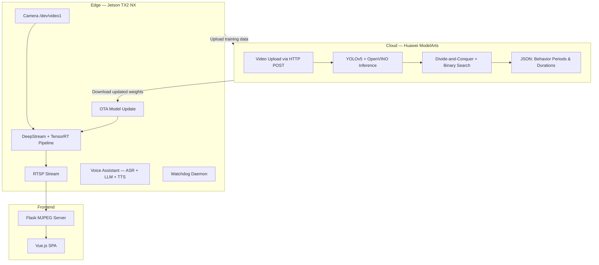

# Fatigue Driving Detection: Cloud-Edge Collaboration

[](LICENSE)
[](https://www.python.org/)
[](https://github.com/Nobody-Zhang/huaweicloud_2023/actions/workflows/lint.yml)

**Award-winning fatigue driving detection system with cloud-edge collaboration between Huawei Cloud ModelArts and NVIDIA Jetson TX2 NX.**

> Second Prize, 18th Challenge Cup National College Students' Extracurricular Academic Science and Technology Works Competition - Huawei Cloud Track

[中文版](README_zh.md)

## Architecture



## Features

- **YOLOv5 + OpenVINO Detection** — Detects 7 classes (close_eye, open_eye, close_mouth, open_mouth, phone, side_face, face) on Huawei Cloud ModelArts
- **Divide-and-Conquer Temporal Localization** — Binary search + recursive partitioning to find exact behavior boundaries without scanning every frame
- **Jetson TX2 NX + DeepStream** — Real-time edge inference via TensorRT with RTSP streaming
- **OTA Model Update** — Upload video to OBS, trigger cloud training, download updated weights — all without stopping inference
- **Voice Interaction** — Three-stage pipeline: Huawei SIS ASR, LLM text generation (LLaMA/Qwen), Huawei SIS TTS

## Quick Start

```bash
git clone https://github.com/Nobody-Zhang/huaweicloud_2023.git
cd huaweicloud_2023
pip install -r requirements.txt
bash scripts/download_assets.sh

# Cloud — Deploy on ModelArts as custom AI application
# Entry point: cloud/preliminary/customize_service.py

# Edge — DeepStream pipeline (requires Jetson TX2 NX)
cd edge/deepstream && sudo make && ./deepstream-customized

# Edge — Watchdog daemon
cd edge/watchdog && mkdir build && cd build && cmake .. && make
```

## Project Structure

```
huaweicloud_2023/
├── cloud/
│   ├── baseline/          # PyTorch + dlib baseline
│   ├── preliminary/       # Best score (0.9741) — divide-and-conquer algorithm
│   └── semifinal/         # Semi-final version (0.8807)
├── edge/
│   ├── deepstream/        # DeepStream GStreamer pipeline + TensorRT
│   ├── ota/               # On-The-Air model update
│   ├── cloud_finetune/    # YOLOv5 training code for cloud
│   ├── voice/             # Voice assistant (ASR + LLM + TTS)
│   ├── watchdog/          # C++ monitoring daemon
│   ├── apigw/             # Huawei API Gateway SDK
│   ├── mtcnn/             # MTCNN face detection service
│   └── frontend/          # Vue.js SPA + Flask backend
├── configs/               # Configuration files
├── scripts/               # Setup and download scripts
└── utils/                 # Shared utilities
```

## Results

| Stage | Score | Key Approach |
|-------|-------|-------------|
| Preliminary | **0.9741** | YOLOv5 + OpenVINO + divide-and-conquer (confidence 0.4) |
| Semi-final | 0.8807 | Same algorithm, relaxed thresholds |
| **Final** | **Second Prize** | Full cloud-edge system demo |

## Citation

```bibtex
@misc{zhang2023fatigue,
    title   = {Fatigue Driving Detection: Cloud-Edge Collaboration},
    author  = {Gongbo Zhang and Shuming Guo and Luran Lv and Aolin Zhang and
               Xingyu Chen and Jintian Wu and Yufan Jia and Zheyu Zhou and
               Jiahao Zhang and Jinshen Zhang},
    year    = {2023},
    url     = {https://github.com/Nobody-Zhang/huaweicloud_2023}
}
```

## License

This project is released under the [Apache 2.0 License](LICENSE).

## Acknowledgments

- **Team**: The Big Radish of the Production Team, HUST
- **Directors**: Jian Zhou, Fei Wu
- **Special Thanks**: Minhan Tang, Yongye Lai, Haoyu Deng, Shiyu Zhang
- Built with [Huawei Cloud ModelArts](https://www.huaweicloud.com/product/modelarts.html), [NVIDIA DeepStream](https://developer.nvidia.com/deepstream-sdk), and [YOLOv5](https://github.com/ultralytics/yolov5)

---

Congratulations to Yongye Lai, Xuejia Chen et al. for winning the **Grand Prize** in the [19th Challenge Cup - Huawei Track](https://github.com/HUSTMiracle/BLBDGCD_huawei2024)!
