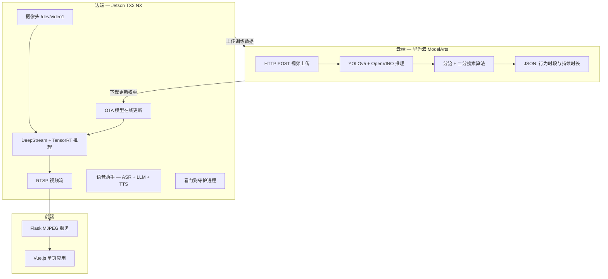

# 疲劳驾驶检测：云边协同系统

[](LICENSE)
[](https://www.python.org/)
[](https://github.com/Nobody-Zhang/huaweicloud_2023/actions/workflows/lint.yml)

**基于华为云 ModelArts 与 NVIDIA Jetson TX2 NX 的云边协同疲劳驾驶检测系统。**

> 第18届"挑战杯"全国大学生课外学术科技作品竞赛 "揭榜挂帅"专项赛 华为云赛道 **二等奖**

[English](README.md)

## 系统架构



## 功能特性

- **YOLOv5 + OpenVINO 检测** — 在华为云 ModelArts 上检测 7 类目标（闭眼、睁眼、闭嘴、张嘴、手机、侧脸、正脸）
- **分治时间定位算法** — 二分搜索 + 递归分区，无需逐帧扫描即可精确定位行为起止时间
- **Jetson TX2 NX + DeepStream** — 基于 TensorRT 的实时边缘推理，支持 RTSP 推流
- **OTA 模型在线更新** — 上传视频至 OBS、触发云端训练、下载更新权重，推理不中断
- **语音交互** — 三阶段语音管线：华为 SIS 语音识别、LLM 文本生成（LLaMA/通义千问）、华为 SIS 语音合成

## 快速开始

```bash
git clone https://github.com/Nobody-Zhang/huaweicloud_2023.git
cd huaweicloud_2023
pip install -r requirements.txt
bash scripts/download_assets.sh

# 云端 — 在 ModelArts 上部署为自定义 AI 应用
# 入口：cloud/preliminary/customize_service.py

# 边端 — DeepStream 推理管线（需要 Jetson TX2 NX）
cd edge/deepstream && sudo make && ./deepstream-customized

# 边端 — 看门狗守护进程
cd edge/watchdog && mkdir build && cd build && cmake .. && make
```

## 项目结构

```
huaweicloud_2023/
├── cloud/
│   ├── baseline/          # PyTorch + dlib 基线方案
│   ├── preliminary/       # 初赛最优方案（0.9741）— 分治算法
│   └── semifinal/         # 复赛方案（0.8807）
├── edge/
│   ├── deepstream/        # DeepStream GStreamer 推理管线 + TensorRT
│   ├── ota/               # OTA 模型在线更新
│   ├── cloud_finetune/    # 云端 YOLOv5 训练代码
│   ├── voice/             # 语音助手（ASR + LLM + TTS）
│   ├── watchdog/          # C++ 监控守护进程
│   ├── apigw/             # 华为 API 网关 SDK
│   ├── mtcnn/             # MTCNN 人脸检测服务
│   └── frontend/          # Vue.js 单页应用 + Flask 后端
├── configs/               # 配置文件
├── scripts/               # 安装与下载脚本
└── utils/                 # 公共工具库
```

## 比赛成绩

| 阶段 | 得分 | 关键方案 |
|------|------|---------|
| 初赛 | **0.9741** | YOLOv5 + OpenVINO + 分治算法（置信度 0.4） |
| 复赛 | 0.8807 | 相同算法，放宽阈值 |
| **决赛** | **二等奖** | 完整云边协同系统演示 |

## 引用

```bibtex
@misc{zhang2023fatigue,
    title   = {Fatigue Driving Detection: Cloud-Edge Collaboration},
    author  = {Gongbo Zhang and Shuming Guo and Luran Lv and Aolin Zhang and
               Xingyu Chen and Jintian Wu and Yufan Jia and Zheyu Zhou and
               Jiahao Zhang and Jinshen Zhang},
    year    = {2023},
    url     = {https://github.com/Nobody-Zhang/huaweicloud_2023}
}
```

## 许可证

本项目基于 [Apache 2.0 许可证](LICENSE) 开源。

## 致谢

- **团队**：生产队的大萝卜，华中科技大学
- **指导老师**：周建、吴飞
- **特别感谢**：唐旻翰、赖永烨、邓浩宇、张时宇
- 基于 [华为云 ModelArts](https://www.huaweicloud.com/product/modelarts.html)、[NVIDIA DeepStream](https://developer.nvidia.com/deepstream-sdk) 和 [YOLOv5](https://github.com/ultralytics/yolov5) 构建

---

恭喜赖永烨、陈学嘉等同学在 [第19届挑战杯华为云赛道](https://github.com/HUSTMiracle/BLBDGCD_huawei2024) 中荣获**特等奖**！
